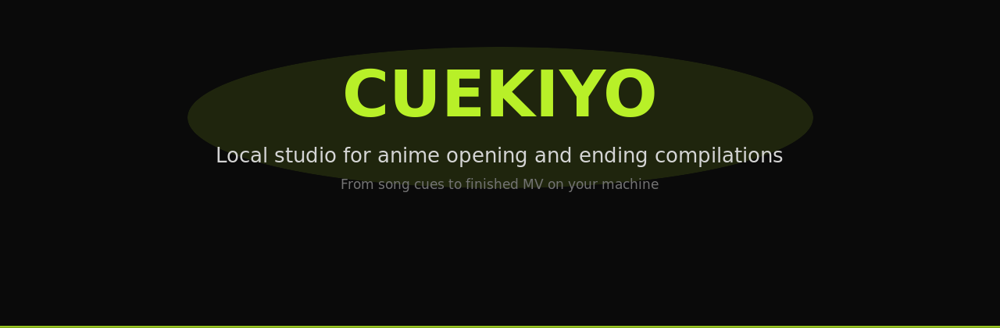
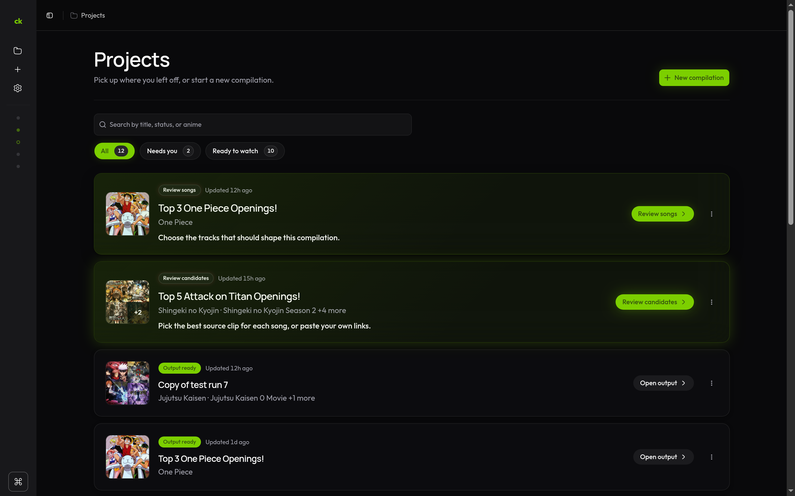
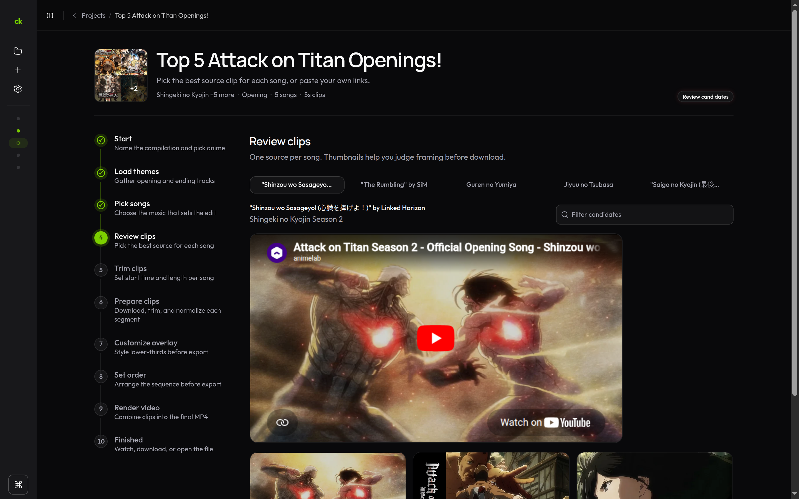
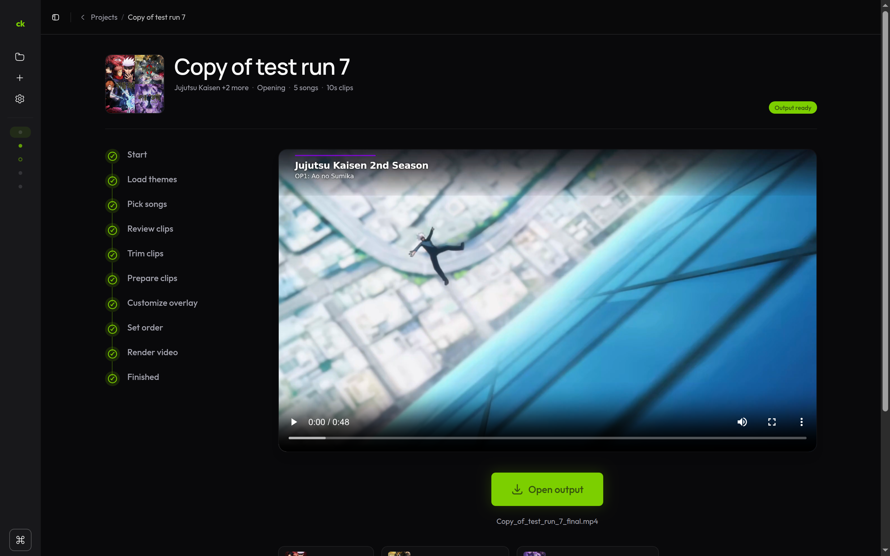

<p align="center">
  
</p>

<p align="center">
  <a href="https://github.com/unloopedmido/cuekiyo/actions/workflows/ci.yml"></a>
  <a href="LICENSE"></a>
  <a href="https://github.com/unloopedmido/cuekiyo"></a>
  
  
  
  
</p>

## Build anime opening/ending compilations without leaving your machine

**Cuekiyo is a local studio for building anime opening and ending compilations.**

Pick the shows, approve the songs, choose the clips, and export a titled compilation without uploading footage, paying for a cloud editor, or stitching everything together by hand.

No cloud. No subscription. No upload step. Just your machine, your files, and a guided workflow that pauses only when you need to make a choice.

## Why Cuekiyo exists

Making anime compilation edits is fun until the workflow turns into a mess:

- hunting openings across YouTube
- checking timestamps manually
- downloading sources one by one
- trimming clips in separate tools
- adding lower-thirds
- normalizing audio
- re-rendering everything when one clip changes

Cuekiyo turns that into a guided local pipeline. You still make the taste decisions (which songs, which clips, what order) while the app handles the repetitive sourcing, cutting, overlay, and render work.

## What it does

| Instead of... | Cuekiyo gives you... |
| --- | --- |
| 12 browser tabs and copied timestamps | One guided flow from show picks to final render |
| Uploading media to random cloud tools | Local files, local database, local exports |
| Manually hunting every opening | Ranked YouTube candidates you can approve or replace |
| Rebuilding the same edit repeatedly | Re-render clips without downloading everything again |
| Losing track of project files | Each project stored under `data/projects/{id}/` |
| Needing one fixed workflow | Paste your own links, import from MyAnimeList, or save project templates |
| Automation guessing wrong on a source | Manual YouTube links per song, always available |

## See it in action

| Dashboard | Review clips | Finished output |
| --- | --- | --- |
|  |  |  |

## Quick start

Requires **Python 3.11+**, **Node.js 24 LTS**, `ffmpeg`, `ffprobe`, and `yt-dlp`.

```bash
git clone https://github.com/unloopedmido/cuekiyo.git
cd cuekiyo
npm run setup
npm run dev
```

Open **http://localhost:5173** and create your first compilation.

Want one URL after setup? Build once, then run the bundled server:

```bash
npm start
```

Open **http://127.0.0.1:8000** (frontend and API on the same port).

## How the flow works

1. **Create a project** — name it, pick anime, choose song types and overlay style.
2. **Select songs** — review the theme list; Cuekiyo sources YouTube candidates (or you paste links).
3. **Review clips** — pick one source per song; trim start and duration if needed.
4. **Render** — confirm order, composite overlays, download the final MP4.

Everything between those steps runs automatically. The app pauses only at song selection, candidate review, optional trim, and render order.

## Local-first by design

Cuekiyo runs on your machine. Projects live in SQLite and on disk under `data/`. Nothing is uploaded to a service you do not control. Your compilations stay yours unless you export them.

That also means you bring the tools: Python, Node, `ffmpeg`, and `yt-dlp`. See [Requirements](#requirements) below.

## Requirements

- **Python** 3.11+
- **Node.js** 24 LTS (`>=24.16.0`)
- **System tools:** `yt-dlp`, `ffmpeg`, `ffprobe`
- **Font** for overlays (e.g. DejaVu on Linux, Arial on Windows)

**Linux (Debian / Ubuntu)** — `sudo apt update && sudo apt install yt-dlp ffmpeg fonts-dejavu-core`  
**macOS** — `brew install yt-dlp ffmpeg`  
**Windows** — `winget install yt-dlp.yt-dlp` and `winget install Gyan.FFmpeg`

<details>
<summary>Linux install on other distros</summary>

**Arch / CachyOS**

```bash
sudo pacman -S yt-dlp ffmpeg ttf-dejavu
```

**Fedora**

```bash
sudo dnf install yt-dlp ffmpeg dejavu-sans-fonts
```

**openSUSE**

```bash
sudo zypper install yt-dlp ffmpeg dejavu-fonts
```

If `yt-dlp` is not in your distro packages, install it from [yt-dlp releases](https://github.com/yt-dlp/yt-dlp/releases) or `pip install yt-dlp`.

</details>

Verify binaries: http://127.0.0.1:8000/api/system/binaries (`yt-dlp`, `ffmpeg`, `ffprobe`, and overlay rendering should all report available after `npm run dev` or `npm start`).

<details>
<summary>Configuration</summary>

- **Compilation defaults** (song count, clip length, encoder, etc.) are saved in your browser on the **Settings** page.
- **Pipeline tuning** (workers, ffmpeg quality, metadata provider, rate limits) uses `.env`. Copy `.env.example` to `.env` and restart the backend.
- **Anime metadata** can be switched between Jikan and AniList on Settings. Theme lists still come from Jikan.

</details>

<details>
<summary>Where Cuekiyo stores files</summary>

| Path | Purpose |
| --- | --- |
| `data/pipeline.db` | SQLite database |
| `data/settings.json` | Legacy pipeline settings (optional) |
| `data/projects/{id}/` | Downloads, clips, output |

These paths are gitignored. Delete `data/pipeline.db` for a clean slate.

</details>

<details>
<summary>Current v1 limitations</summary>

- One pipeline job at a time (global lock)
- Concat crossfade chain is simplified for 2+ clips
- Retry infers failed stage from the last failed job

</details>

## Contributing

```bash
npm test
npm run lint
npm run format
```

See [CONTRIBUTING.md](CONTRIBUTING.md) for PR guidelines and [SECURITY.md](SECURITY.md) for vulnerability reports.

<details>
<summary>Manual verification checklist</summary>

### Manual source mode

1. Create project with "I'll paste YouTube links"
2. Complete song selection → confirm pipeline skips sourcing and lands on review clips
3. Paste a valid YouTube URL per song; confirm thumbnail/title appear
4. After last song, confirm download starts automatically

### Overlay, trim, reprocess, templates

- Overlay disabled → no lower-third on final clips; minimal + top position → overlay at top
- Trim gate → custom start/duration on one song; heatmap on another
- Re-apply overlay / render again → no re-download
- Duplicate project, download clips ZIP, save/load project templates
- Bulk MyAnimeList import + unlimited songs; crossfade 0 s vs 1 s on final MP4

</details>

## Legal notice

Cuekiyo is **local personal software**. It does not host, distribute, or publish your videos.

**You are solely responsible** for rights and permissions on any anime footage, music, and third-party video you source or export, and for complying with copyright law and platform terms (including YouTube's Terms of Service).

The authors are **not affiliated with your output** and do not review compilations you create.

## License

MIT — see [LICENSE](LICENSE).
